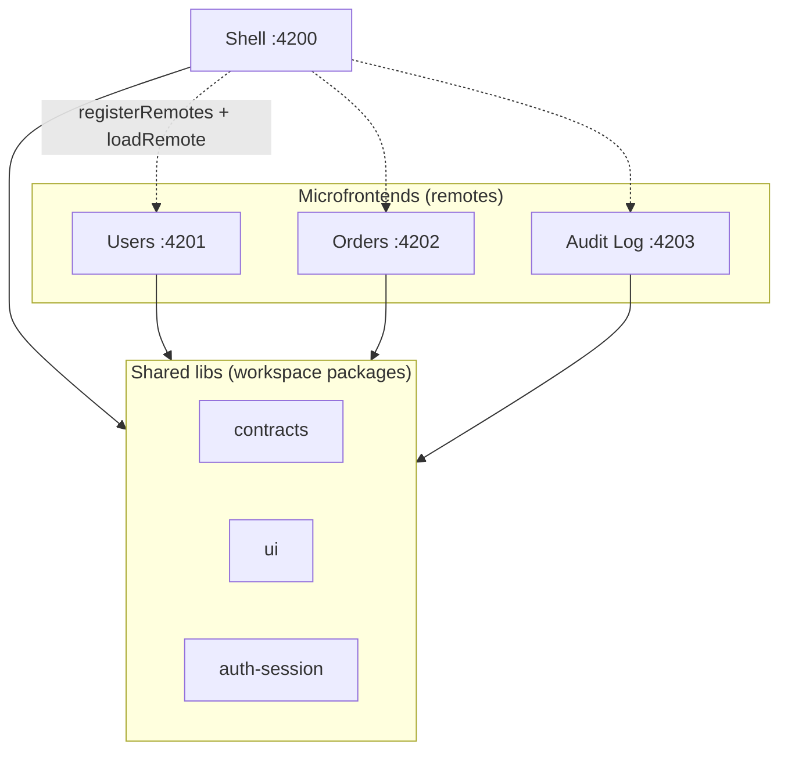

<div align="center">

# Microfrontend Backoffice Demo

[](https://vuejs.org)
[](https://module-federation.io)
[](https://pnpm.io)

</div>

A microfrontend backoffice: a **shell** host and three independently deployed
**microfrontends**, composed at runtime with Module Federation. Built on
**Vue 3** + **vite-plus** (a pnpm monorepo toolchain).

## Architecture



The shell is the only thing loaded first. It reads
`apps/shell/public/manifest.json`, calls `registerRemotes(...)`, and lazily
`loadRemote()`s each microfrontend's `Root` component when you navigate to its
route. There is **no build-time coupling** between apps — a remote can be down
and the rest of the shell keeps working.

Microfrontends never import each other. They communicate through a typed event
bus (`@advancedfrontend/contracts`) backed by `BroadcastChannel`, so events
cross tabs.

## Stack

- **pnpm** workspace (catalog-managed versions)
- **vite-plus** (`vp`) — unified dev/build/test toolchain
- **Vue 3** (`<script setup lang="ts">`)
- **@module-federation/vite** + **@module-federation/runtime**
- **msw** — mocked backend (no real server)

## Getting started

Prerequisites: Node 22+, pnpm.

```bash
pnpm install
pnpm dev   # starts all 4 apps in parallel (vp run -r --parallel dev)
```

Open `http://localhost:4200`. Log in (mocked):

| Account              | Password   | Role                       |
| -------------------- | ---------- | -------------------------- |
| `admin@example.com`  | `password` | admin — full actions       |
| `viewer@example.com` | `password` | viewer — read-only screens |

The sidebar is built from the manifest; clicking a link loads that remote into
the content area at runtime.

### Single app (standalone)

| Command                       | URL                     |
| ----------------------------- | ----------------------- |
| `pnpm --filter shell dev`     | `http://localhost:4200` |
| `pnpm --filter users dev`     | `http://localhost:4201` |
| `pnpm --filter orders dev`    | `http://localhost:4202` |
| `pnpm --filter audit-log dev` | `http://localhost:4203` |

## Feature walkthrough

**Roles.** Users and Orders have searchable, filterable, paginated tables +
detail pages. Admin sees action buttons; viewer is read-only.

**Cross-app events.** Deactivating a user emits `user:deactivated` on the
shared bus. The shell shows a notification badge, Orders refreshes its table,
and Audit Log appends an entry. No cross-imports — each app subscribes
independently.

**Failure isolation.** Stop a remote's dev server (or point its manifest entry
at a bad URL). That section renders a "temporarily unavailable" fallback with
a Retry button; the shell, sidebar, and other remotes stay up.

## Repository layout

```
apps/
  shell/       # host: page frame, login, loads remotes via MF
  users/       # Team A microfrontend
  orders/      # Team B microfrontend
  audit-log/   # Team C microfrontend: cross-app event log
libs/
  contracts/     # shared types + typed event bus
  ui/            # design tokens + Button/Tooltip
  auth-session/  # session store (window-global backed)
```

Each app imports libs via pnpm workspace links (`@advancedfrontend/*`).
